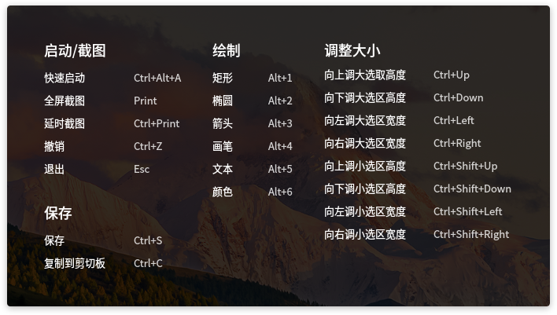
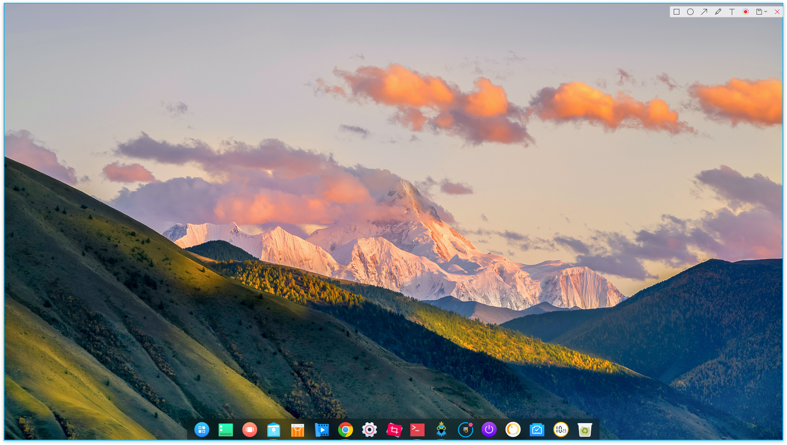
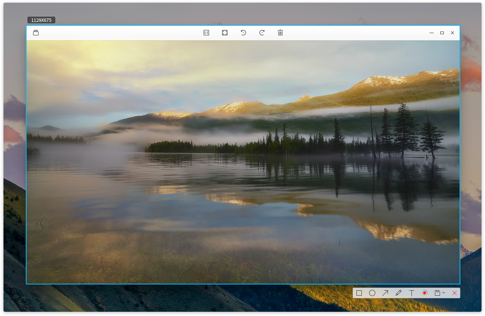
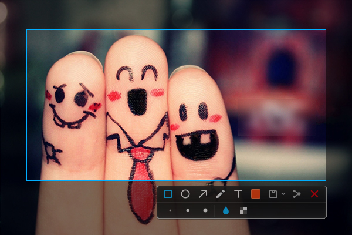
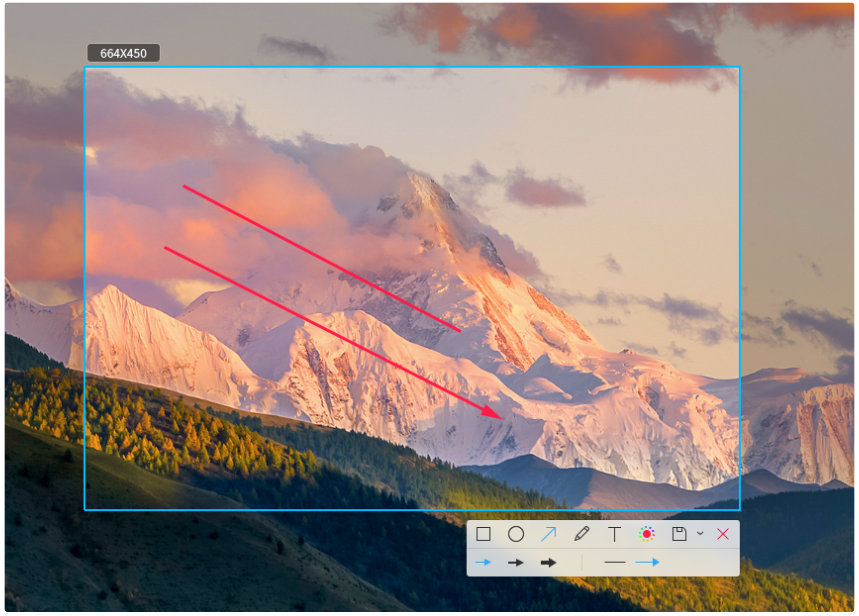
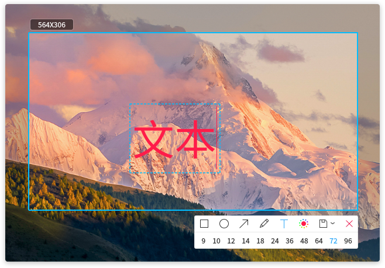

# 深度截图|../common/deepin-screenshot.svg|

## 概述|../common/icon_overview.svg|
深度截图是武汉深之度科技有限公司开发的深度操作系统下自带的截图工具。在日常工作和娱乐中，为了展示特定状态下的程序界面，应用场景等，需要截取可以显示在屏幕或其他显示设备上的可视图像，您可以通过运行深度截图软件来实现。

深度截图拥有模糊和马赛克的图片编辑功能，在传播图片的过程中帮助您保护隐私信息不外泄，支持丰富的网络社交平台，让您随时随地的与朋友互动，分享身边的精彩！

您可以通过多种方式来实现快速截图：

* 使用键盘上的  键来截取整个显示器的屏幕。

* 使用各个应用软件如腾讯 QQ、Chrome 浏览器等软件的截图功能。

* 使用专业的截图软件来截取屏幕，如深度操作系统自带的深度截图软件。

## 基本操作|../common/icon_basicoperation.svg|

### 运行深度截图
您可以通过执行以下操作之一来运行深度截图，进入截图模式后，整个电脑屏幕将会变暗。

* 在任务栏上，点击  进入启动器界面，通过浏览找到  点击。

* 按下键盘上的 ++ 组合键来快速运行深度截图。

### 延时截图

延时截图给您预留了5s的准备时间，帮您截取最精准的瞬间。

> ：如果您已经将深度截图固定到任务栏，右键单击任务栏上的 ，然后选择 **延时截图** 来延时截取。

您也可以通过操作以下步骤来实现延时截图：

1. 按下键盘上的 + 组合键。

2. 在屏幕的右上角，您会看到“深度截图将在5秒后启动”的提示信息。

3. 等待5s后自动进入截图模式，整个屏幕变暗。

### 退出深度截图

在截图模式下，您可以通过以下两种方式来退出截图：

* 按下键盘上的  键。

* 点击鼠标右键，选择 **退出**。

## 快捷键|../common/icon_shortcutkey.svg|

通过快捷键来进行相关操作，省时又省力。

1. 在截图模式下，按下键盘上的 ++ 组合键，打开快捷键预览界面。

2. 在快捷键预览界面，您可以查看到所有的快捷键。

<table class="block2">
    <caption>启动/截图</caption>
    <tbody>
        <tr>
            <td>快速启动</td>
            <td>Ctrl+Alt+A</td>
        </tr>
        <tr>
            <td>全屏截图</td>
            <td>Print</td>
        </tr>
        <tr>
            <td>延时截图</td>
            <td>Ctrl+Print</td>
        </tr>
        <tr>
            <td>退出</td>
            <td>Esc</td>
        </tr>
        <tr>
            <td>&nbsp;</td>
            <td>&nbsp;</td>
        </tr>
        <tr>
            <td>&nbsp;</td>
            <td>&nbsp;</td>
        </tr>
    </tbody>
</table>
<table class="block2">
    <caption>绘图</caption>
    <tbody>
        <tr>
            <td>矩形工具</td>
            <td>Alt+1</td>
        </tr>
        <tr>
            <td>椭圆工具</td>
            <td>Alt+2</td>
        </tr>
        <tr>
            <td>箭头工具</td>
            <td>Alt+3</td>
        </tr>
        <tr>
            <td>画笔工具</td>
            <td>Alt+4</td>
        </tr>
        <tr>
            <td>文本工具</td>
            <td>Alt+5</td>
        </tr>
        <tr>
            <td>颜色工具</td>
            <td>Alt+6</td>
        </tr>
    </tbody>
</table>
<table class="block2">
    <caption>调整大小</caption>
    <tbody>
        <tr>
            <td>向上调大选区高度</td>
            <td>Ctrl+Up</td>
        </tr>
        <tr>
            <td>向下调大选区高度</td>
            <td>Ctrl+Down</td>
        </tr>
        <tr>
            <td>向左调大选区宽度</td>
            <td>Ctrl+Left</td>
        </tr>
        <tr>
            <td>向右调大选区宽度</td>
            <td>Ctrl+Right</td>
        </tr>
        <tr>
            <td>向上调小选区高度</td>
            <td>Ctrl+Shift+Up</td>
        </tr>
        <tr>
          <td>向下调小选区高度</td>
          <td>Ctrl+Shift+Down</td>
        </tr>
        <tr>
            <td>向左调小选区宽度</td>
            <td>Ctrl+Shift+Left</td>
        </tr>
        <tr>
          <td>向右调小选区宽度</td>
          <td>Ctrl+Shift+Right</td>
        </tr>
    </tbody>
</table>
<table class="block2">
    <caption>保存/分享</caption>
    <tbody>
        <tr>
            <td>保存</td>
            <td>Ctrl+S</td>
        </tr>
        <tr>
            <td>分享</td>
            <td>Ctrl+Enter</td>
        </tr>
        <tr>
            <td>&nbsp;</td>
            <td>&nbsp;</td>
        </tr>
        <tr>
          <td>&nbsp;</td>
          <td>&nbsp;</td>
        </tr>
        <tr>
            <td>&nbsp;</td>
            <td>&nbsp;</td>
        </tr>
        <tr>
          <td>&nbsp;</td>
          <td>&nbsp;</td>
        </tr>
        <tr>
            <td>&nbsp;</td>
            <td>&nbsp;</td>
        </tr>
        <tr>
          <td>&nbsp;</td>
          <td>&nbsp;</td>
        </tr>
    </tbody>
</table>

## 选择截图区域|../common/icon_screenshotarea.svg|

目前比较常用的有三种截图区域：全屏、程序窗口和自选区域。在截图时选中对应的区域，在区域四周会出现一个蓝色边框，并且该区域会亮度显示。

> ：当电脑多屏显示时，您也可以使用深度截图来截取不同屏幕上的区域。

### 选择全屏	

选择全屏是识别当前显示器的整个屏幕。

您可以通过操作以下步骤来选择全屏：

1. 按下键盘上的 ++ 组合键，进入截图模式。

2. 将鼠标指针移至桌面上，深度截图会自动选中整个屏幕，并在其左上角显示当前截图区域的尺寸大小。

3. 点击桌面，在桌面的右上角会弹出工具栏。

4. 如果要退出截图，请点击工具栏上的  或点击鼠标右键选择 **退出**。

您也可以直接操作以下步骤来进行全屏截图：

* 如果您已经将深度截图固定到任务栏，右键单击任务栏上的 ，然后选择 **截取全屏** 。

* 按下键盘上的  键，实现全屏截图。

### 选择程序窗口
选择程序窗口是自动识别当前的应用窗口。

1. 按下键盘上的 ++ 组合键，进入截图模式。

2. 将鼠标指针移至打开的应用窗口上，深度截图会自动选中该窗口，并在其左上角显示当前截图区域的尺寸大小。

3. 点击窗口，在窗口的右下角会弹出工具栏。

4. 如果要退出截图，请点击工具栏上的  或点击鼠标右键选择 **退出**。

### 选择自选区域
选择自选区域是通过拖动鼠标，自由选择截取的范围。

1. 按下键盘上的 ++ 组合键，进入截图模式。

2. 按住鼠标左键不放，拖动鼠标选择截图区域，在其左上角将实时显示当前截图区域的尺寸大小。

3. 释放鼠标左键，完成截图，在截图区域的右下角会弹出工具栏。

4. 如果要退出截图，请点击工具栏上的  或点击鼠标右键选择 **退出**。

## 调整截图区域|../common/icon_adjustscreenshot.svg|

您可以对截图区域进行微调，例如放大或缩小截取范围，移动截图等。

### 放大/ 缩小截图区域
将鼠标指针置于截图区域的蓝色边框上，鼠标指针变为 。您可以：

* 按住鼠标左键不放，拖动鼠标来放大或缩小截图区域。

* 按下键盘上的 + 或  来上下扩展截图区域，按下键盘上的 + 或  来左右扩展截图区域。

### 移动截图位置
将鼠标指针置于截图区域上，鼠标指针变为 。您可以：

* 按住鼠标左键不放，拖动鼠标来移动截图区域的位置。

* 按下键盘上的  或  来上下移动截图区域，按下键盘上的  或  来左右移动截图区域。

## 编辑截图|../common/icon_editscreenshot.svg|

深度截图自带的图片编辑功能，包括图形标记、文字批注等，完全可以满足您的日常图片处理需求。您还可以给图片打上马赛克，保护您的隐私。

您可以通过执行以下操作之一来编辑截图：

* 点击工具栏上的工具图标来编辑。

* 通过快捷键来快速切换各个编辑工具。

* 当选中截图区域后，点击鼠标右键来选择编辑工具。

### 工具栏说明
在截图过程中，您可以点击工具栏上的各个图标以完成各项操作。运行深度截图，通过鼠标选中截图区域后，工具栏会自动出现在截图的下方。

> ：如果您已经对工具栏展开面板，如线条粗细、字体大小等进行了设置，深度截图会记住您的选择。当您下次启动深度截图后，将默认使用该设置，您也可以重新进行选择。

<table class="block1">
    <caption>图标说明</caption>
    <tbody>
        <tr>
            <td></td>
            <td>矩形工具</td>
            <td class="blank"></td>
            <td></td>
            <td>椭圆工具</td>
	    <td class="blank"></td>
            <td></td>
            <td>保存</td>
        </tr>
          <tr>
            <td></td>
            <td>箭头工具</td>
            <td class="blank"></td>
            <td></td>
            <td>文本工具</td>
            <td class="blank"></td>
            <td></td>
            <td>分享</td>
        </tr>
        <tr>
            <td></td>
            <td>画笔工具</td>
            <td class="blank"></td>
            <td></td>
            <td>颜色工具</td>
            <td class="blank"></td>
            <td></td>
            <td>退出截图</td>
        </tr>
    </tbody>
</table>

### 绘制图形
您可以在截取的图片中绘制一些简单的图形，如矩形、椭圆等。

 

#### 矩形工具

1. 在截图区域下方的工具栏中，点击 。

2. 在工具栏展开面板中，选择矩形边线的粗细。

3. 将鼠标指针置于截图区域上，鼠标指针变为 。

4. 按住鼠标左键不放，拖动鼠标以完成图形区域的绘制。

5. 如果截图中包含了个人隐私信息，请点击工具栏展开面板中的  或  来涂抹。

#### 椭圆工具

1. 在截图区域下方的工具栏中，点击 。

2. 在工具栏展开面板中，选择椭圆边线的粗细。

3. 将鼠标指针置于截图区域上，鼠标指针变为 。

4. 按住鼠标左键不放，拖动鼠标以完成图形区域的绘制。

5. 如果截图中包含了个人隐私信息，请点击工具栏展开面板中的  或  来涂抹。

#### 箭头工具

1. 在截图区域下方的工具栏中，点击 。

2. 在工具栏展开面板中，选择箭头的粗细。

3. 将鼠标指针置于截图区域上，鼠标指针变为 。

4. 按住鼠标左键不放，拖动鼠标以完成图形区域的绘制。

#### 画笔工具

1. 在截图区域下方的工具栏中，点击 。

2. 在工具栏展开面板中，选择画笔的粗细。

3. 点击 ，在自由画笔和直线画笔之间切换。

4. 将鼠标指针置于截图区域上，鼠标指针变为 。

5. 按住鼠标左键不放，拖动鼠标以完成图形区域的绘制。

如果需要绘制正方形、圆形等图形，您可以：

  * 按住键盘上的  键，然后选择 ，绘制正方形。
  * 按住键盘上的  键，然后选择 ，绘制圆形。
  * 按住键盘上的  键，然后选择 ，绘制水平或垂直方向的箭头。
  * 按住键盘上的  键，然后选择 ，绘制水平或垂直方向的直线。

### 修改图形
如果您在截图中绘制了其他的图形，您可以对绘制的图形进行修改和移动。

#### 移动图形
1. 将鼠标指针置于图形的边线上，此时鼠标指针变为 。

2. 按住鼠标左键不放，可以将图形移动到截图区域的任何位置。

3. 按下键盘上的  或  来上下移动图形，按下键盘上的  或  来左右移动图形。

#### 编辑图形
1. 将鼠标指针置于图形的边线上。

2. 点击鼠标左键，进入图形的编辑模式，您可以：

   - 按下键盘上的  键，删除图形。

   - 按下键盘上的 + 键，返回至上一步操作。

   - 将鼠标指针置于编辑框上，此时鼠标指针变成 ，通过拖动鼠标指针，来放大或缩小图形区域。

   - 按下键盘上的 + 或  来上下扩展图形区域，按下键盘上的 + 或  来左右扩展图形区域。

   - 将鼠标指针置于编辑框的  上，此时鼠标指针变成 ，通过拖动鼠标指针，来旋转图形。

3. 在编辑框外点击鼠标左键，退出编辑模式。

### 添加文字批注
对截取的图片进行文字补充和说明，帮助他人更清楚的了解截取的图片。

1. 在截图区域下方的工具栏中，点击 。

2. 在工具栏展开面板中，输入字号大小或通过点击  或  来增大或减小批注的字体大小。

3. 将鼠标指针置于截取的图片上，此时鼠标指针变为 。

4. 点击要添加批注的地方，将出现一个待输入的文本框。

5. 在文本框中输入文字。

### 修改文字批注
如果您已经添加了文字批注，您可以对文字批注进行修改和移动。

#### 移动文字批注
1. 将鼠标指针置于文字上，此时鼠标指针变为 。

2. 按住鼠标左键不放，可以将文字移动到截图区域的任何位置。

3. 按下键盘上的  或  来上下移动文本框，按下键盘上的  或  来左右移动文本框。

#### 编辑文字批注
1. 将鼠标指针置于文字上。

2. 点击鼠标左键，进入文字编辑模式，您可以：

   - 按下键盘上的  键，删除文字批注。

   - 按下键盘上的 + 键，返回至上一步操作。

   - 在文本框内，修改文字信息。
   
   - 按下键盘上的 + 或  来上下扩展文本框，按下键盘上的 + 或  来左右扩展文本框。

   - 将鼠标指针置于文本框的  上，此时鼠标指针变成 ，通过拖动鼠标指针，来旋转文字批注。

3. 在文本框外点击鼠标左键，退出编辑模式。

### 设置标记颜色
深度截图总共提供了16种颜色供您选择，您可以选择不同的颜色来进行不同的图形标记。

1. 在截图区域下方的工具栏中，点击 。

2. 在工具栏展开面板中，选择一种颜色。

## 保存截图|../common/icon_savescreenshot.svg|
将截取的图片保存下来，为后续的使用储存素材！

当截图保存成功之后，您可以在桌面右上角看到提示信息，点击 **查看**，可打开截图所在的文件夹。

您可以通过执行以下操作之一来保存截取的图片：

* 按下键盘上的 + 组合键来保存。

* 按下键盘上的  键来直接保存。

* 在截取的图片中，点击鼠标右键，选择 **保存** 或双击鼠标完成保存操作。

> ：在以上操作中，截取的图片默认存放到系统的图片文件夹下。

您还可以在截图区域下方的工具栏中，点击  的下拉选项：

* 选择 ，将图片保存到系统默认的图片文件夹下。

* 选择 ，将图片保存到桌面。

* 选择 ，将图片保存到您指定的存储路径下。

* 选择 ，将图片复制到剪切板。

* 选择 ，将图片保存到系统默认的图片文件夹下，并复制到剪切板。

* 通过左右拖动滑条来调节保存图片的质量。

## 分享截图|../common/icon_sharescreenshot.svg|
您可以将有趣的图片截取下来，配上文字，将这份快乐传递给您的好友，让更多人感受到！

您可以按下键盘上的 + 组合键，快速实现分享！您也可以执行以下操作来分享：

1. 在截图区域下方的工具栏中，点击 。

2. 在分享界面中，输入您想说的文字，点击 **下一步**。

3. 选择一个社交账号，点击 **分享**。

4. 登录您的社交账号授权并分享。

5. 当分享成功之后，您可以在桌面右上角看到提示信息。

6. 如果分享失败，请点击 **重试** 再次分享。

7. 如果要退出分享，请点击 **关闭**。

> ：在分享界面输入的文字请控制在140字以内。当分享截图后，深度截图会记住您的账号与密码，以便下次的分享操作！

在分享界面中，点击左下角的 ，选择 **账户管理**，您可以对多个账号进行管理：

* 注销登录账号。
* 使用一个新的账号来登录分享。
